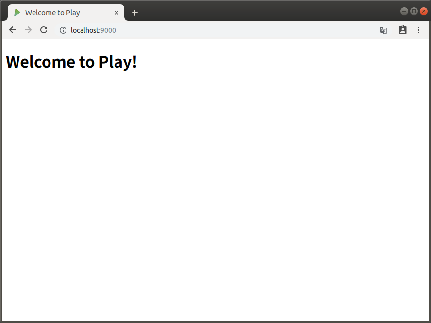
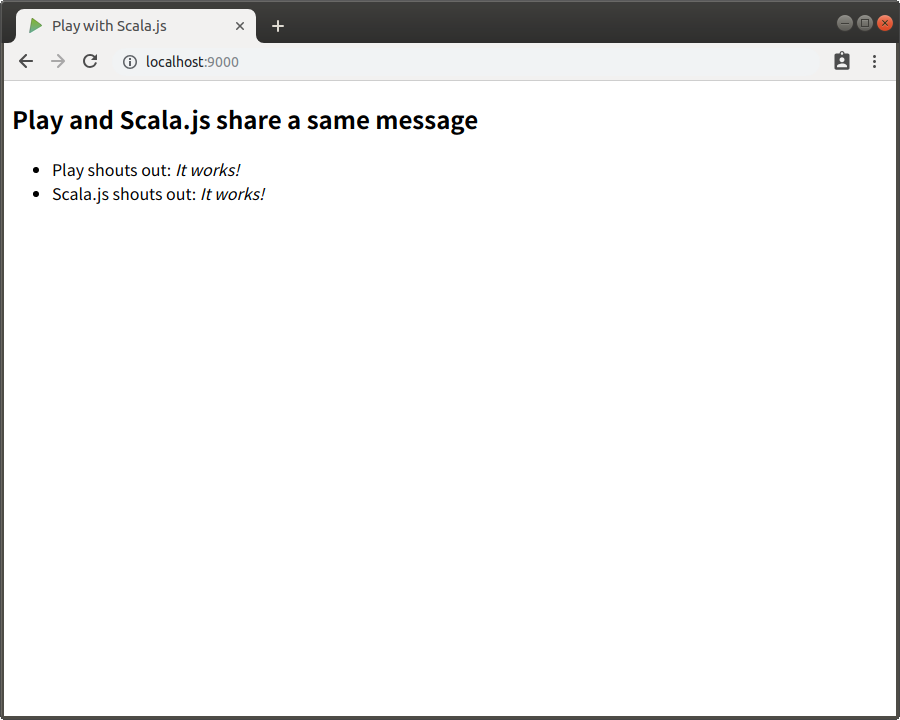

## Scalaによる、リアルタイムWebアプリケーションの構築メモ

Scalaで、チャット・ルームのWebアプリを作りながら、リアルタイムWebアプリケーションを作ってみた例です。

以下の3つを使って、Webアプリを構築していきます。
* [Play Framework](https://www.playframework.com/)
  ScalaおよびJavaのためのWebアプリケーション・フレームワークです。
* [Scala.js](https://www.scala-js.org/)
* [Akka.Js](https://github.com/akka-js/akka.js)

### 前提条件

ここでは、Ubuntu 18.04を使って構築していく方法について記載します。

### 準備

Play Frameworkを利用するには、Javaとsbt(Scala等用のビルドツール)が必要です。よって、Javaとsbtをインストールします。尚、Scala自体は、sbtによってインストールされます。

#### Javaの開発環境(JDK)のインストール

JDKをインストールします。ここでは、[AdoptOpenJDK](https://adoptopenjdk.net/)の[Ubuntu向けのインストーラ・パッケージ](https://github.com/rpardini/adoptopenjdk-deb-installer)を使ってインストールします。

```bash
sudo add-apt-repository --yes ppa:rpardini/adoptopenjdk
sudo apt-get update
sudo apt-get install adoptopenjdk-8-jdk-hotspot-set-default
```

Javaのライセンス価格やサポート期間については色々と騒ぎになりましたが、以下の通りの結論になりそうです。
* Oracle JDK  
  Javaの開発元による開発環境。Java 11からは実運用に使うには、 *Oracleと有償契約* が必要。LTS(長期サポート)版は、5年間のサポートがある。追加のサポートとして、更に3年、無期限のサポートもある。
* OpenJDK  
  Oracleがメインスポンサーとなっていて、 *無償で* 利用できる開発環境。ただし半年毎にリリースがあり、そのリリースを持って旧バージョンのサポートは終了する。実質的に、半年しか利用できない。
* AdoptOpenJDK  
  IBM、Microsoft等がスポンサーとなっている、OpenJDKのビルド済みバイナリの配布プロジェクトによる開発環境。独自に[最低4年間のLTS](https://adoptopenjdk.net/support.html#roadmap)も設定している(Java 8の場合は、2023年9月まで)。無償でJavaを利用したい場合は、これを利用する事に落ち着きそう。

#### sbtのインストール

sbtをインストールします。

```bash
echo "deb https://dl.bintray.com/sbt/debian /" | sudo tee -a /etc/apt/sources.list.d/sbt.list
sudo apt-key adv --keyserver hkp://keyserver.ubuntu.com:80 --recv 2EE0EA64E40A89B84B2DF73499E82A75642AC823
sudo apt-get update
sudo apt-get install sbt
```

### Play Frameworkのテンプレート・プロジェクトの作成

sbtのコマンドを、以下の通り実行してプロジェクトを作成します。

```bash
sbt new playframework/play-scala-seed.g8
```

最後に、以下のように、Playのプロジェクト名、組織名を尋ねられるので、名前を`scala-chat`に、組織名はデフォルトのままにします。

```
name [play-scala-seed]: scala-chat
organization [com.example]: 
```

その後、scala-chatディレクトリにテンプレートのプロジェクトが作成されるので、ディレクトリを移動して、動かしてみます。(最初のrunでは、必要の各種jarのチェックのダウンロードが行われるので、時間がかかります。)

```
cd scala-chat
sbt run
```

起動したら、以下のようなメッセージが出力されます。(終了するには `Ctrl+D` を押下します。)

```
[info] p.c.s.AkkaHttpServer - Listening for HTTP on /0:0:0:0:0:0:0:0:9000

(Server started, use Enter to stop and go back to the console...)
```

Webブラウザを起動し、 `http://localhost:9000/` のURLを入力します。以下のような画面が表示されます。



ここまでの結果は、[v1.0.0](https://github.com/horie-t/realtime-web-in-scala/tree/v1.0.0)タグを参照してください。

### Play Frameworkプロジェクトの構成

Play Frameworkにファイルを配置する時は、以下のようなレイアウトで配置します。前記のテンプレートでは生成されないディレクトリも記述しています。

```
app                      → アプリケーションのソース
 └ assets                → コンパイルされるアセットのソース
    └ stylesheets        → LESS CSSのソース等
    └ javascripts        → CoffeeScriptのソース等
 └ controllers           → アプリケーションのコントローラのコード
 └ models                → アプリケーションのビジネス層のコード
 └ views                 → テンプレート・ファイル
build.sbt                → アプリケーションのビルド・スクリプト
conf                     → コンフィグレーション・ファイルとその他のコンパイルされないリソース(クラスパスでアクセスされる)
 └ application.conf      → メインのコンフィグレーション・ファイル
 └ routes                → ルート定義
dist                     → 配布物に含まれる任意のファイル
public                   → 公開アセット
 └ stylesheets           → CSSファイル
 └ javascripts           → Javascriptファイル
 └ images                → 画像ファイル
project                  → sbtのコンフィグレーション・ファイル
 └ build.properties      → sbtプロジェクトのプロパティ
 └ plugins.sbt           → Play自体のための定義も含めたsbtプラグイン定義
lib                      → 管理されていない依存ライブラリ
logs                     → ログ・フォルダ
 └ application.log       → デフォルトのログ・ファイル
target                   → 生成物
 └ resolution-cache      → 依存関係の情報
 └ scala-2.11
    └ api                → 生成された API 文書
    └ classes            → コンパイルされたクラス・ファイル
    └ routes             → routesから生成されたソース
    └ twirl              → templatesから生成されたソース
 └ universal             → アプリケーションのパッケージ
 └ web                   → コンパイルされたwebのアセット
test                     → 単体、もしくは機能テストのソースフォルダ
```

### Scala.jsとPlay Frameworkの統合プロジェクトの作成

sbtのコマンドを、以下の通り実行してプロジェクトを作成します。

```bash
sbt new vmunier/play-scalajs.g8
```

最後に、以下のように、プロジェクト名、組織名、パッケージ名を尋ねられるので、名前を`scala-chat-scalajs`に、組織名、パッケージ名はデフォルトのままにします。

```
name [play-scalajs]: scala-chat-scalajs
organization [com.example]: 
package [com.example.scalachatscalajs]: 
```

```bash
cd scala-chat-scalajs
sbt run
```

Webブラウザを起動し、 `http://localhost:9000/` のURLを入力します。以下のような画面が表示されます。



ここまでの結果は、[v2.0.0](https://github.com/horie-t/realtime-web-in-scala/tree/v2.0.0)タグを参照してください。
